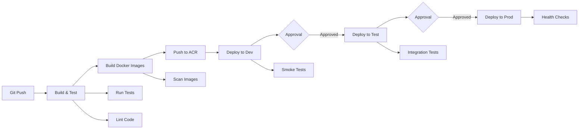
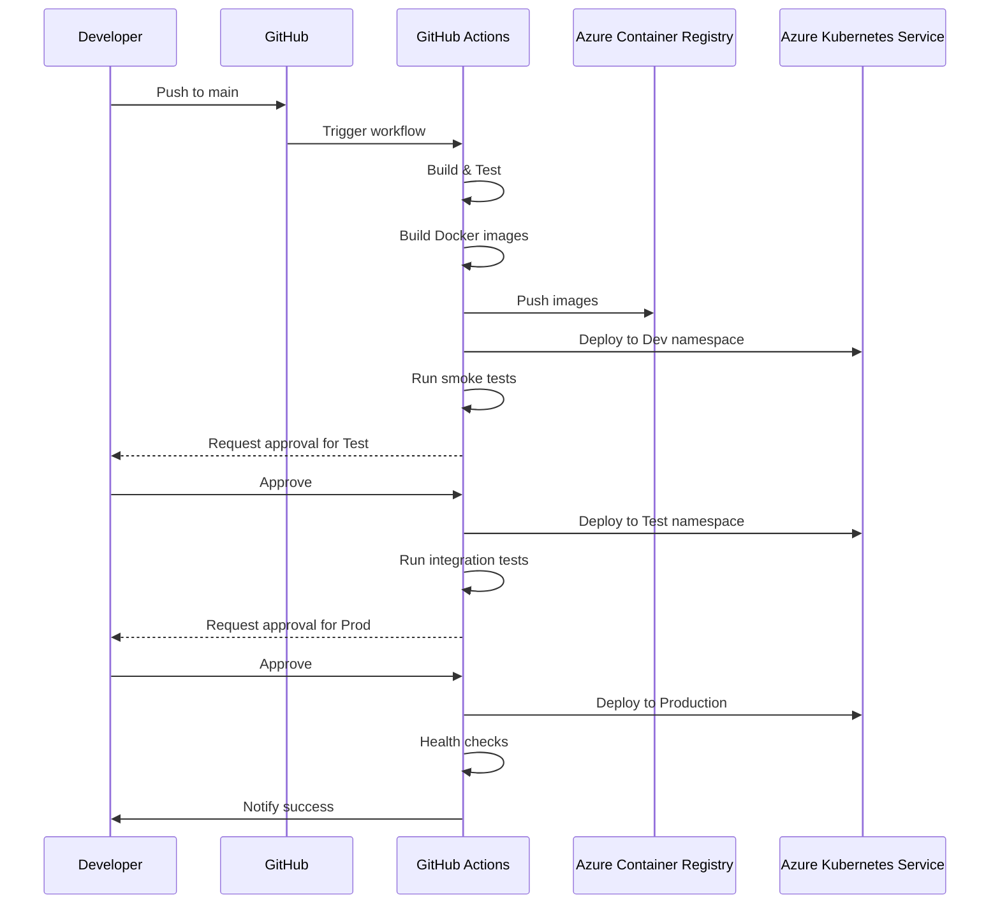

# CI/CD Pipeline Documentation

## Overview

The StudySphere CI/CD pipeline is built using GitHub Actions and automates the entire software delivery process from code commit to production deployment.

## Pipeline Architecture



## Pipeline Stages

### 1. Build and Test (3-5 minutes)

**Triggers:**
- Push to `main` or `develop` branches
- Pull requests to `main` or `develop`
- Manual workflow dispatch

**Steps:**
1. Checkout code
2. Setup Node.js 18
3. Install dependencies (all services + frontend)
4. Generate Prisma client
5. Run linting (ESLint)
6. Run unit tests (Jest)
7. Build frontend (Vite)
8. Upload build artifacts

**Success Criteria:**
- All tests pass
- No linting errors
- Frontend builds successfully
- Code coverage > 70%

### 2. Build and Push Docker Images (5-8 minutes)

**Triggers:**
- Successful build on `main` branch only

**Steps:**
1. Login to Azure
2. Authenticate with ACR
3. Build Docker images for each service:
   - `auth-service`
   - `user-service`
   - `group-service`
   - `chat-service`
   - `frontend`
4. Tag images with:
   - Commit SHA (e.g., `abc1234`)
   - `latest`
5. Push images to Azure Container Registry
6. Scan images for vulnerabilities (Trivy)

**Artifacts:**
```
studysphereacr.azurecr.io/auth-service:abc1234
studysphereacr.azurecr.io/auth-service:latest
studysphereacr.azurecr.io/user-service:abc1234
...
```

### 3. Deploy to Development (2-3 minutes)

**Triggers:**
- Successful image build
- Automatic deployment

**Environment:**
- Namespace: `development`
- URL: `https://dev.studysphere.example.com`

**Steps:**
1. Set AKS context
2. Create/update namespaces
3. Create/update Kubernetes secrets
4. Deploy services with commit SHA tags
5. Apply deployments and services
6. Wait for rollout completion
7. Run smoke tests

**Deployment Strategy:**
- Rolling update
- Zero-downtime deployment
- Readiness/liveness probes

### 4. Deploy to Testing (2-3 minutes)

**Triggers:**
- Successful dev deployment
- **Manual approval required**

**Environment:**
- Namespace: `testing`
- URL: `https://test.studysphere.example.com`

**Steps:**
1. Deploy to testing namespace
2. Run integration tests
3. Verify all services healthy

**Integration Tests:**
- API endpoint tests
- Database connectivity
- GenAI service integration
- Socket.io real-time functionality

### 5. Deploy to Production (3-5 minutes)

**Triggers:**
- Successful test deployment
- **Manual approval required**

**Environment:**
- Namespace: `production`
- URL: `https://studysphere.example.com`

**Steps:**
1. Create production secrets
2. Deploy with commit SHA tags
3. Apply ingress and HPA
4. Verify rollout status
5. Run health checks
6. Notify team

**Production Safeguards:**
- Manual approval gates
- Rollback capability
- Health check validation
- Traffic monitoring

## Pipeline Flow Diagram



## Environment Promotion

| Environment | Branch | Approval | URL | Purpose |
|-------------|--------|----------|-----|---------|
| Development | `main` | Automatic | `dev.studysphere.example.com` | Latest features, frequent updates |
| Testing | `main` | Manual | `test.studysphere.example.com` | QA validation, integration tests |
| Production | `main` | Manual | `studysphere.example.com` | Live application, stable releases |

## Required Secrets

Configure these secrets in GitHub repository settings:

### Azure Credentials
```bash
AZURE_CREDENTIALS - Service principal JSON
ARM_CLIENT_ID
ARM_CLIENT_SECRET
ARM_TENANT_ID
ARM_SUBSCRIPTION_ID
```

### Container Registry
```bash
ACR_NAME - studysphereacr
ACR_LOGIN_SERVER - studysphereacr.azurecr.io
```

### Kubernetes
```bash
AKS_CLUSTER_NAME - studysphere-aks
AKS_RESOURCE_GROUP - studysphere-rg
```

### Application Secrets
```bash
DATABASE_URL - PostgreSQL connection string
JWT_SECRET - JWT signing key
AZURE_OPENAI_KEY - Azure OpenAI API key
AZURE_OPENAI_ENDPOINT - Azure OpenAI endpoint
AZURE_MODERATOR_KEY - Content Moderator key
AZURE_MODERATOR_ENDPOINT - Content Moderator endpoint
```

## Rollback Strategy

### Automatic Rollback
- Triggered on deployment failure
- Reverts to previous stable version

### Manual Rollback
```bash
# Rollback to previous version
kubectl rollout undo deployment/auth-service -n production

# Rollback to specific revision
kubectl rollout undo deployment/auth-service --to-revision=5 -n production

# Check rollout history
kubectl rollout history deployment/auth-service -n production
```

## Monitoring and Alerts

### Deployment Metrics
- Build duration
- Test success rate
- Deployment frequency
- Failure rate
- Mean time to recovery (MTTR)

### Notifications
- Slack integration for deployment status
- Email alerts for failures
- GitHub commit status checks

## Security Scanning

### Image Scanning (Trivy)
```bash
# Scan for vulnerabilities
trivy image studysphereacr.azurecr.io/auth-service:latest

# Fail on HIGH or CRITICAL vulnerabilities
trivy image --exit-code 1 --severity HIGH,CRITICAL image_name
```

### Dependency Scanning
- Dependabot for npm packages
- Automated security updates

## Performance Optimization

### Build Cache
- Docker layer caching
- npm cache in GitHub Actions
- Prisma client generation cache

### Parallel Execution
- Matrix strategy for building multiple services
- Concurrent test execution

## Troubleshooting

### Common Issues

**Issue: Docker build fails**
```bash
# Check Docker daemon
docker ps

# Review build logs
docker build --progress=plain .
```

**Issue: AKS deployment fails**
```bash
# Check pod status
kubectl get pods -n production

# View pod logs
kubectl logs deployment/auth-service -n production

# Describe pod for events
kubectl describe pod <pod-name> -n production
```

**Issue: Tests fail**
```bash
# Run tests locally
npm test

# Check test coverage
npm run test:coverage
```

## Best Practices

1. **Always test locally** before pushing to main
2. **Use feature branches** for development
3. **Squash commits** for clean history
4. **Write meaningful commit messages**
5. **Monitor deployment** in real-time
6. **Verify health checks** post-deployment
7. **Keep secrets secure** - never commit to git
8. **Review logs** after each deployment

## CI/CD Metrics

### Target Performance
- Build time: < 10 minutes
- Deployment time: < 5 minutes per environment
- Test coverage: > 70%
- Deployment success rate: > 95%
- Mean time to deploy: < 20 minutes (dev to prod)

### Monitoring Dashboard
- GitHub Actions dashboard
- Azure Portal (AKS insights)
- Prometheus + Grafana (optional)

## References

- [GitHub Actions Documentation](https://docs.github.com/en/actions)
- [Azure Kubernetes Service](https://docs.microsoft.com/en-us/azure/aks/)
- [Docker Best Practices](https://docs.docker.com/develop/dev-best-practices/)
- [Kubernetes Deployment Strategies](https://kubernetes.io/docs/concepts/workloads/controllers/deployment/)

