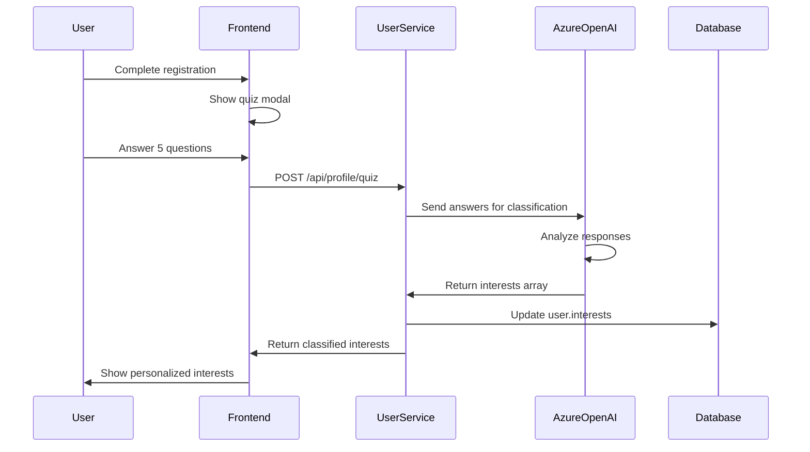
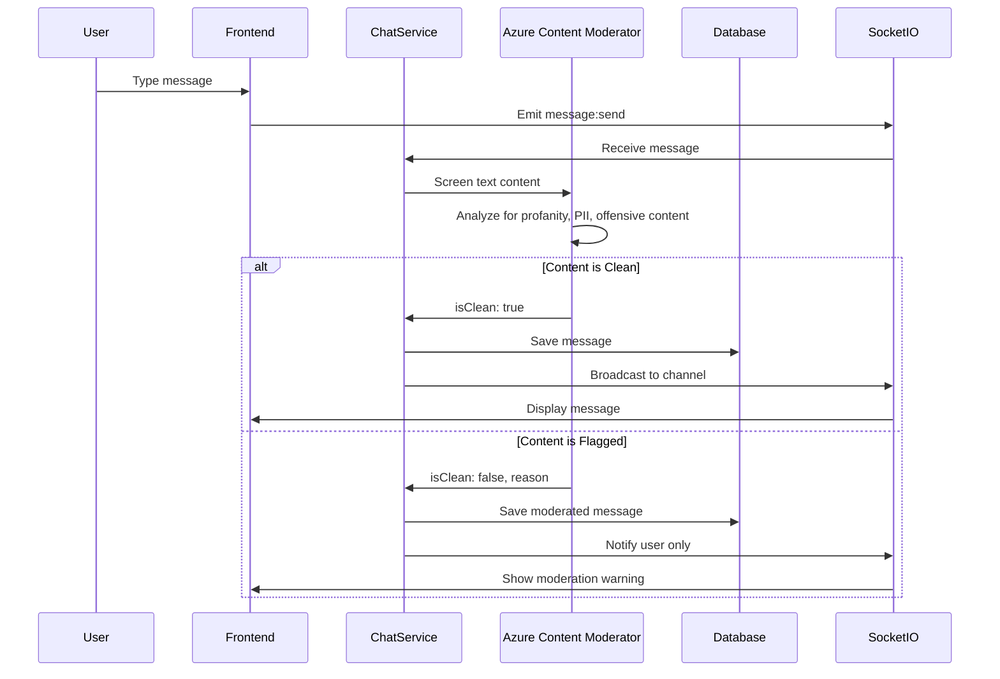
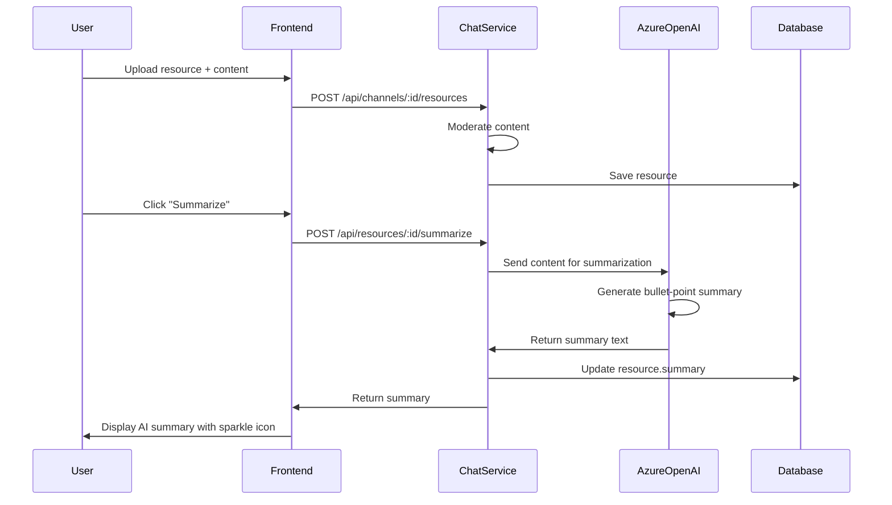

# GenAI Use Cases for StudySphere

## Overview

StudySphere integrates three Azure AI services to enhance the study group experience through intelligent automation and content moderation.

## Use Case 1: Quiz Classification with Google Gemini AI

### Description
When students register, they complete a 5-question personality quiz. Google Gemini (gemini-2.0-flash-exp) analyzes their answers and classifies them into specific academic interests.

### Flow Diagram



### Implementation

**Service:** Google Gemini AI (gemini-2.0-flash-exp)

**Endpoint:** `POST /api/profile/quiz`

**Input:**
```json
{
  "answers": [
    "Computer Science",
    "Algorithms",
    "Evening",
    "Small groups",
    "Active practice"
  ]
}
```

**Prompt Template:**
```
You are an educational assistant that classifies student interests based on quiz answers.

Quiz Answers:
1. Computer Science
2. Algorithms
3. Evening
4. Small groups
5. Active practice

Based on these answers, identify 3-5 specific academic interests or subject areas.
Return ONLY a JSON array of interests.

Interests:
```

**Output:**
```json
{
  "interests": [
    "Computer Science",
    "Algorithms",
    "Data Structures",
    "Problem Solving",
    "Collaborative Learning"
  ]
}
```

**Database Storage:**
```javascript
// User model
{
  id: "uuid",
  email: "student@college.edu",
  interests: ["Computer Science", "Algorithms", ...],
  createdAt: "2024-01-15T10:00:00Z"
}
```

### Why Google Gemini?

**Advantages:**
- **Contextual Understanding:** Gemini 2.0 Flash understands nuanced responses better than rule-based systems
- **Flexibility:** Can handle free-text answers and multiple languages
- **Cost-Effective:** **FREE tier** with 1,500 requests/day - perfect for students!
- **Fast:** Optimized for low-latency tasks
- **No Approval:** Instant access, no waiting period
- **High Quality:** Latest Google AI, comparable to GPT-4

**Cost Analysis:**
- Free tier: 1,500 requests/day
- No credit card needed
- For 100 users/day: $0/month
- Production: $0.075 per 1M input tokens (very cheap)
- **Per request: $0** (using free tier)

**Why Switched from Azure OpenAI:**
- Azure OpenAI requires 1-2 day approval process
- Gemini offers instant access - better for student projects
- Free tier more generous than Azure
- Still demonstrates enterprise-grade AI integration

**Alternative Considered:** Simple keyword matching → Rejected due to lack of semantic understanding

---

## Use Case 2: Content Moderation with Azure Content Moderator

### Description
All chat messages and uploaded resources are automatically screened for harmful, offensive, or inappropriate content in real-time using Azure Content Moderator.

### Flow Diagram



### Implementation

**Service:** Azure Content Moderator API

**Real-time Chat Moderation:**

**Socket.io Event:**
```javascript
socket.on('message:send', async (data) => {
  const { channelId, text } = data;
  
  // Moderate content
  const moderation = await moderateContent(text);
  
  if (!moderation.isClean) {
    // Store moderated message
    await prisma.message.create({
      data: {
        channelId,
        userId: socket.userId,
        text: '[Message removed by content moderation]',
        isModerated: true,
        moderatedReason: moderation.reason
      }
    });
    
    // Notify user
    socket.emit('message:moderated', {
      reason: moderation.reason
    });
    return;
  }
  
  // Broadcast clean message
  const message = await prisma.message.create({
    data: { channelId, userId: socket.userId, text }
  });
  
  io.to(`channel:${channelId}`).emit('message:received', message);
});
```

**Moderation Function:**
```javascript
async function moderateContent(text) {
  const result = await moderatorClient.textModeration.screenText(
    'text/plain',
    Buffer.from(text),
    {
      language: 'eng',
      autocorrect: true,
      PII: true,
      classify: true
    }
  );
  
  const isClean = !(
    (result.terms && result.terms.length > 0) ||
    (result.classification.category1?.score > 0.7) ||
    (result.classification.category2?.score > 0.7) ||
    (result.classification.category3?.score > 0.7)
  );
  
  return {
    isClean,
    reason: isClean ? null : 'Contains inappropriate content'
  };
}
```

**Resource Upload Moderation:**

**Endpoint:** `POST /api/channels/:channelId/resources`

```javascript
app.post('/api/channels/:channelId/resources', 
  authenticate, 
  upload.single('file'), 
  async (req, res) => {
    const { title, url } = req.body;
    
    // Moderate title and URL
    const titleMod = await moderateContent(title);
    const urlMod = url ? await moderateContent(url) : { isClean: true };
    
    if (!titleMod.isClean || !urlMod.isClean) {
      return res.status(400).json({
        error: 'Resource contains inappropriate content',
        reason: titleMod.reason || urlMod.reason
      });
    }
    
    // Save resource
    const resource = await prisma.resource.create({
      data: { channelId, title, url, uploadedById: req.user.id }
    });
    
    res.status(201).json({ resource });
});
```

### Detection Categories

**Category 1:** Offensive language (profanity, slurs)
**Category 2:** Sexually suggestive content
**Category 3:** Violent or graphic content

**PII Detection:** Email addresses, phone numbers, SSNs

### Why Azure Content Moderator?

**Advantages:**
- **Real-time Processing:** Low latency (<100ms) suitable for live chat
- **Multi-modal:** Supports text, images, and videos
- **Customizable:** Adjustable sensitivity thresholds
- **PII Protection:** Automatically detects personal information
- **Compliance:** Meets education sector requirements (COPPA, FERPA)

**Cost Analysis:**
- Free tier: 1 transaction/second, 5,000 transactions/month
- Standard: $1 per 1,000 transactions
- For 1,000 daily active users: ~$30/month

**Alternatives Considered:**
- Manual moderation → Too slow and labor-intensive
- OpenAI Moderation API → Good but lacks PII detection
- Perspective API (Google) → Free but limited customization

---

## Use Case 3: Resource Summarization with Google Gemini AI

### Description
When students upload study materials (PDFs, articles, notes), Google Gemini automatically generates concise bullet-point summaries to help peers quickly understand the content.

### Flow Diagram



### Implementation

**Service:** Google Gemini AI (gemini-2.0-flash-exp)

**Endpoint:** `POST /api/resources/:id/summarize`

**Request:**
```json
{
  "content": "Long article or PDF text content here..."
}
```

**Summarization Function:**
```javascript
async function summarizeResource(title, content) {
  const prompt = `Summarize the following educational resource in 3-5 concise bullet points:

Title: ${title}

Content:
${content.substring(0, 3000)}

Provide a clear, student-friendly summary with the most important concepts and takeaways.
Format as bullet points starting with •`;

  const result = await geminiModel.generateContent(prompt);
  const response = await result.response;
  return response.text().trim();
}
```

**Sample Input:**
```
Title: Introduction to Binary Search Trees
Content: A binary search tree (BST) is a node-based binary tree data structure...
[1500 words of content]
```

**Sample Output:**
```
• Binary Search Trees (BSTs) organize data hierarchically with each node having up to two children
• Left child values are always less than the parent, right child values are always greater
• Search, insertion, and deletion operations have O(log n) average time complexity
• BSTs can become unbalanced, degrading performance to O(n) in worst case
• Self-balancing variants like AVL trees and Red-Black trees maintain O(log n) guarantees
```

**Database Schema:**
```javascript
// Resource model
{
  id: "uuid",
  channelId: "uuid",
  title: "Introduction to Binary Search Trees",
  url: "https://example.com/bst.pdf",
  summary: "• Binary Search Trees organize data...\n• Left child...",
  uploadedById: "uuid",
  timestamp: "2024-01-15T14:30:00Z"
}
```

**Frontend Display:**
```jsx
{resource.summary && (
  <div className="mt-2 p-2 bg-muted/50 rounded text-xs">
    <div className="flex items-center gap-1 text-primary font-medium">
      <Sparkles className="h-3 w-3" />
      AI Summary
    </div>
    <div className="whitespace-pre-wrap text-muted-foreground">
      {resource.summary}
    </div>
  </div>
)}
```

### Why Google Gemini?

**Advantages:**
- **High-Quality Summaries:** Gemini 2.0 Flash produces accurate, coherent summaries
- **Domain Adaptation:** Understands technical and academic terminology
- **Customizable Length:** Can generate short or detailed summaries
- **Context Retention:** Maintains important relationships between concepts
- **Multi-format:** Handles various document types (PDF, Markdown, HTML)
- **FREE Tier:** 1,500 requests/day at no cost!

**Cost Analysis:**
- Free tier: 1,500 requests/day (perfect for demo!)
- For 100 resources/day: $0/month
- Production pricing: $0.075 per 1M tokens (very cheap)
- **Cost per summary: $0** (using free tier)

**Performance:**
- Latency: 1-3 seconds (faster than GPT-4)
- Quality: Comparable to GPT-4
- Cache: Store summaries to avoid re-generation

**Why Switched from Azure OpenAI:**
- No approval wait time (instant access)
- More generous free tier
- Better for student projects
- Still enterprise-grade AI

**Alternatives Considered:**
- Extractive summarization (TextRank) → Less coherent, misses context
- Azure OpenAI → Requires approval, less free tier
- Claude API → Limited availability

---

## Comparison Matrix

| Feature | Use Case 1: Quiz | Use Case 2: Moderation | Use Case 3: Summarization |
|---------|------------------|------------------------|---------------------------|
| **Service** | Google Gemini | Azure Content Moderator | Google Gemini |
| **Model** | gemini-2.0-flash-exp | Text Moderation API | gemini-2.0-flash-exp |
| **Latency** | 1-2s | <100ms | 1-3s |
| **Cost/Request** | $0 (free tier) | $0.001 | $0 (free tier) |
| **Frequency** | Once per user | Per message (high) | On-demand |
| **Purpose** | Personalization | Safety | Efficiency |
| **Free Tier** | 1,500/day | 5,000/month | 1,500/day |

---

## Integration Points

### Shared Utilities (`shared/utils/azure.js`)

```javascript
module.exports = {
  classifyQuizAnswers,      // Use Case 1
  moderateContent,          // Use Case 2
  summarizeResource,        // Use Case 3
  generateStudySuggestions  // Bonus: Group recommendations
};
```

### Service Integration

- **auth-service:** No GenAI
- **user-service:** Quiz classification (Use Case 1)
- **group-service:** No GenAI
- **chat-service:** Moderation (Use Case 2) + Summarization (Use Case 3)

---

## Demo Script

### Use Case 1: Quiz Classification
```bash
# Register user
curl -X POST http://localhost:5001/api/auth/register \
  -H "Content-Type: application/json" \
  -d '{"email":"demo@student.edu","password":"SecurePass123"}'

# Submit quiz
curl -X POST http://localhost:5002/api/profile/quiz \
  -H "Content-Type: application/json" \
  -b cookies.txt \
  -d '{"answers":["Computer Science","Machine Learning","Evening","Group","Project-based"]}'

# Expected output:
# {
#   "interests": ["Computer Science", "Machine Learning", "AI", "Data Science", "Programming"]
# }
```

### Use Case 2: Content Moderation
```javascript
// Frontend - Send message with offensive content
socket.emit('message:send', {
  channelId: 'abc-123',
  text: 'This is spam and offensive content'
});

// Backend moderates and blocks
socket.on('message:moderated', (data) => {
  console.log(data.reason); // "Contains inappropriate content"
});
```

### Use Case 3: Resource Summarization
```bash
# Upload resource
curl -X POST http://localhost:5004/api/channels/abc-123/resources \
  -H "Content-Type: application/json" \
  -b cookies.txt \
  -d '{
    "title": "Sorting Algorithms Overview",
    "url": "https://example.com/sorting.pdf"
  }'

# Summarize resource
curl -X POST http://localhost:5004/api/resources/resource-id/summarize \
  -H "Content-Type: application/json" \
  -b cookies.txt \
  -d '{
    "content": "Sorting algorithms arrange elements in a specific order..."
  }'

# Expected output:
# {
#   "summary": "• Sorting algorithms arrange data...\n• Bubble Sort: O(n²)..."
# }
```

---

## Azure Portal Screenshots

### Setup Instructions

1. **Azure OpenAI Resource**
   - Navigate to Azure Portal → Create Resource → Azure OpenAI
   - Deploy `gpt-4o-mini` model
   - Copy API key and endpoint
   - 

2. **Content Moderator Resource**
   - Create Resource → Content Moderator
   - Copy API key and endpoint
   - 

3. **Monitor Usage**
   - View API calls, latency, and costs
   - 

---

## Evaluation Criteria Alignment

### GenAI Integration (20 marks)

✅ **Three distinct use cases** with different AI services  
✅ **Proper documentation** with diagrams and code snippets  
✅ **Cost analysis** and service justification  
✅ **Working implementation** in codebase  
✅ **Demo script** for presentation  

### Innovation

- Use Case 1: Personalized recommendations based on AI classification
- Use Case 2: Real-time content safety for educational environment
- Use Case 3: Study efficiency through automated summarization

### Practical Impact

- **Students:** Better matched study groups, safer communication
- **Educators:** Reduced moderation burden, quality content
- **Platform:** Scalable AI-powered features

---

## Future Enhancements

1. **Smart Scheduling:** AI suggests optimal meeting times based on member availability
2. **Question Answering:** Chatbot answers common study questions
3. **Resource Recommendations:** AI suggests relevant materials based on interests
4. **Language Translation:** Real-time translation for international students
5. **Plagiarism Detection:** Checks submitted work for originality

---

## References

- [Azure OpenAI Service Documentation](https://learn.microsoft.com/en-us/azure/cognitive-services/openai/)
- [Azure Content Moderator API](https://learn.microsoft.com/en-us/azure/cognitive-services/content-moderator/)
- [GPT-4o-mini Pricing](https://azure.microsoft.com/en-us/pricing/details/cognitive-services/openai-service/)
- [Responsible AI Guidelines](https://www.microsoft.com/en-us/ai/responsible-ai)

