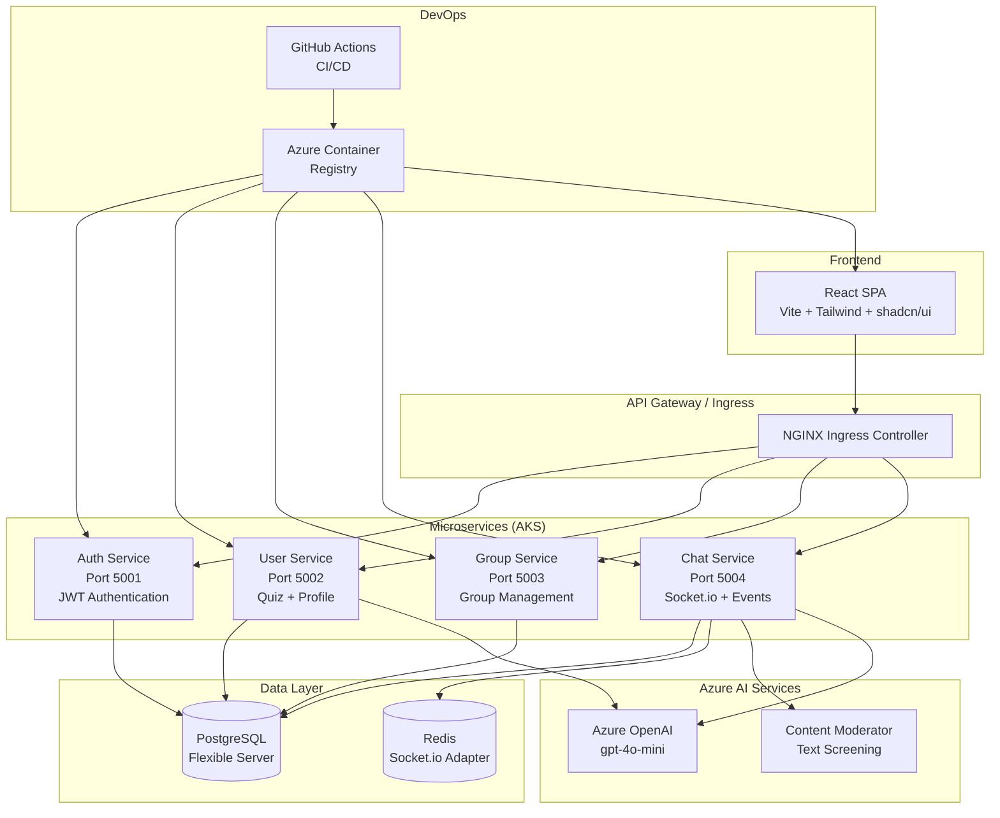
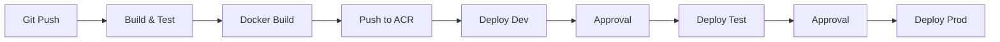
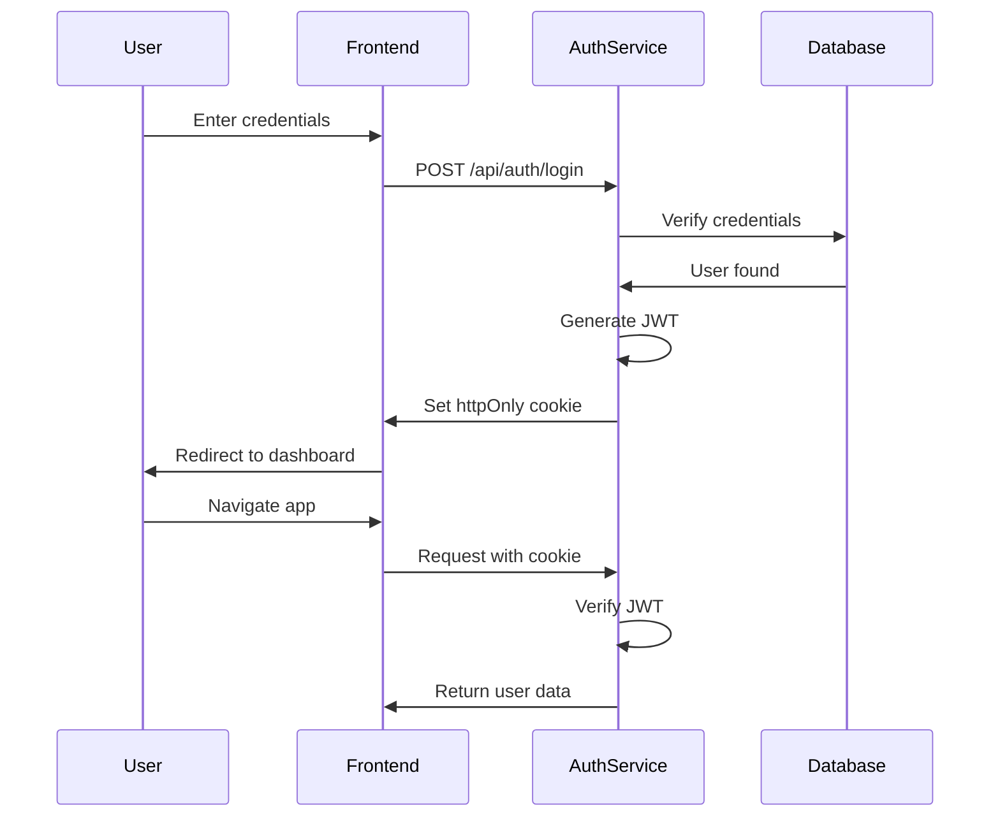

# StudySphere Architecture Documentation

## System Overview

StudySphere is a cloud-native microservices application built on Azure, designed for college students to create and manage study groups with real-time collaboration features.

## High-Level Architecture



## Component Details

### Frontend Layer

**Technology Stack:**
- **Framework:** React 18 with Vite
- **Styling:** Tailwind CSS + shadcn/ui component library
- **State Management:** React Hooks (useState, useEffect, useContext)
- **Routing:** React Router v6
- **HTTP Client:** Axios
- **Real-time:** Socket.io-client

**Key Features:**
- Responsive Discord-like UI (sidebar, main area, right panel)
- JWT authentication with httpOnly cookies
- Real-time chat with Socket.io
- Profile quiz with AI classification
- Event scheduling and resource management

**Pages:**
- `/login` - Login form
- `/register` - Registration form
- `/profile-quiz` - 5-question onboarding quiz
- `/dashboard` - Main application (groups, chat, events, resources)

### API Gateway

**NGINX Ingress Controller**
- Routes traffic to appropriate microservices
- TLS termination
- Load balancing
- Path-based routing:
  - `/api/auth/*` → Auth Service
  - `/api/profile/*` → User Service
  - `/api/groups/*` → Group Service
  - `/api/channels/*`, `/api/events/*`, `/api/resources/*` → Chat Service

### Microservices

#### 1. Auth Service (Port 5001)

**Responsibilities:**
- User registration and login
- JWT token generation
- Token verification
- Password hashing (bcrypt)
- Session management

**Endpoints:**
```
POST /api/auth/register - Create new user account
POST /api/auth/login    - Authenticate user
GET  /api/auth/me       - Get current user (protected)
POST /api/auth/logout   - Clear authentication
POST /api/auth/verify   - Verify token (internal)
```

**Dependencies:**
- Prisma Client (database access)
- bcryptjs (password hashing)
- jsonwebtoken (JWT signing)
- cookie-parser (cookie handling)

#### 2. User Service (Port 5002)

**Responsibilities:**
- User profile management
- Profile quiz with Azure OpenAI classification
- Interest-based study suggestions
- User search

**Endpoints:**
```
GET    /api/profile               - Get user profile
POST   /api/profile/quiz          - Submit quiz answers (GenAI)
GET    /api/profile/suggestions   - Get study group suggestions
PATCH  /api/profile               - Update profile
GET    /api/users/:id             - Get user by ID
GET    /api/users/search          - Search users
```

**GenAI Integration:**
- Azure OpenAI classifies quiz answers into interests

#### 3. Group Service (Port 5003)

**Responsibilities:**
- Study group CRUD operations
- Group membership management
- Channel creation and management
- Owner/admin permissions

**Endpoints:**
```
GET    /api/groups              - List all groups
GET    /api/groups/:id          - Get group details
POST   /api/groups              - Create new group
PATCH  /api/groups/:id          - Update group
DELETE /api/groups/:id          - Delete group
POST   /api/groups/:id/join     - Join group
POST   /api/groups/:id/leave    - Leave group
GET    /api/groups/:id/channels - List channels
POST   /api/groups/:id/channels - Create channel
DELETE /api/channels/:id        - Delete channel
```

#### 4. Chat Service (Port 5004)

**Responsibilities:**
- Real-time chat with Socket.io
- Message moderation
- Event scheduling (Google Meet)
- Resource uploads and summarization
- File uploads with multer

**REST Endpoints:**
```
GET    /api/channels/:id/messages       - Get message history
GET    /api/channels/:id/events         - List events
POST   /api/channels/:id/events         - Create event
PATCH  /api/events/:id                  - Update event
DELETE /api/events/:id                  - Delete event
GET    /api/channels/:id/resources      - List resources
POST   /api/channels/:id/resources      - Upload resource
POST   /api/resources/:id/summarize     - Summarize resource (GenAI)
DELETE /api/resources/:id               - Delete resource
```

**Socket.io Events:**
```javascript
// Client → Server
'channel:join'    - Join channel room
'channel:leave'   - Leave channel room
'message:send'    - Send chat message (with moderation)
'typing:start'    - Start typing indicator
'typing:stop'     - Stop typing indicator

// Server → Client
'message:received'   - New message broadcast
'message:moderated'  - Message was moderated
'event:created'      - New event
'resource:created'   - New resource
'resource:updated'   - Resource summarized
'typing:user'        - User is typing
```

**GenAI Integration:**
- Content Moderator screens chat messages and resources
- Azure OpenAI generates resource summaries

### Data Layer

#### PostgreSQL Flexible Server

**Models (Prisma Schema):**

```prisma
User {
  id          String    @id @default(uuid())
  email       String    @unique
  password    String
  interests   Json[]    @default([])
  
  ownedGroups  Group[]
  memberships  GroupMember[]
  messages     Message[]
  events       Event[]
  resources    Resource[]
}

Group {
  id          String    @id @default(uuid())
  name        String
  description String?
  ownerId     String
  
  owner       User
  members     GroupMember[]
  channels    Channel[]
}

Channel {
  id        String    @id @default(uuid())
  groupId   String
  name      String
  type      String    @default("text")
  
  group     Group
  messages  Message[]
  events    Event[]
  resources Resource[]
}

Message {
  id              String    @id @default(uuid())
  channelId       String
  userId          String
  text            String
  timestamp       DateTime  @default(now())
  isModerated     Boolean   @default(false)
  moderatedReason String?
}

Event {
  id            String    @id @default(uuid())
  channelId     String
  title         String
  description   String?
  gmeetLink     String?
  scheduledDate DateTime
  createdById   String
}

Resource {
  id              String    @id @default(uuid())
  channelId       String
  title           String
  url             String?
  summary         String?
  uploadedById    String
  timestamp       DateTime  @default(now())
  isModerated     Boolean   @default(false)
}
```

**Connection:**
- Connection pooling via Prisma
- SSL required for Azure PostgreSQL
- Automatic migrations via Prisma Migrate

#### Redis

**Purpose:**
- Socket.io adapter for horizontal scaling
- Session storage (future)
- Caching layer (future)

**Configuration:**
```javascript
const redis = require('redis');
const { createAdapter } = require('@socket.io/redis-adapter');

const pubClient = redis.createClient({ url: process.env.REDIS_URL });
const subClient = pubClient.duplicate();

io.adapter(createAdapter(pubClient, subClient));
```

### Azure AI Services

#### 1. Azure OpenAI (gpt-4o-mini)

**Use Cases:**
- Quiz answer classification → User interests
- Resource content summarization → Bullet-point summaries
- Study group suggestions (bonus)

**Configuration:**
```javascript
const openaiClient = new OpenAI({
  apiKey: process.env.AZURE_OPENAI_KEY,
  baseURL: `${process.env.AZURE_OPENAI_ENDPOINT}/openai/deployments/gpt-4o-mini`,
  defaultQuery: { 'api-version': '2024-02-15-preview' }
});
```

#### 2. Azure Content Moderator

**Use Cases:**
- Real-time chat message screening
- Resource title/URL validation
- PII detection

**Configuration:**
```javascript
const moderatorClient = new ContentModeratorClient(
  new msRest.ApiKeyCredentials({ 
    inHeader: { 'Ocp-Apim-Subscription-Key': process.env.AZURE_MODERATOR_KEY }
  }),
  process.env.AZURE_MODERATOR_ENDPOINT
);
```

## Infrastructure as Code

### Terraform Resources

**Azure Resources Provisioned:**
1. **Resource Group** - studysphere-rg
2. **PostgreSQL Flexible Server** - studysphere-postgres-dev
   - SKU: B_Standard_B1ms
   - Storage: 32GB
   - Backups: 7 days
3. **Azure Container Registry** - studysphereacr
   - SKU: Standard
   - Admin enabled
4. **Azure Kubernetes Service** - studysphere-aks
   - Node pool: 2x Standard_B2s
   - Auto-scaling: 2-10 nodes
   - Network: Azure CNI
5. **Log Analytics Workspace** - studysphere-logs-dev

**Remote State:**
- Stored in Azure Storage Account
- Backend: azurerm
- State locking enabled

## Kubernetes Architecture

### Namespaces

- `development` - Dev environment
- `testing` - QA environment
- `production` - Live environment

### Deployments

Each service runs with:
- **Replicas:** 2 (minimum)
- **Image:** studysphereacr.azurecr.io/service:tag
- **Resources:**
  - Auth/User/Group: 100m CPU, 128Mi RAM (limits: 500m, 512Mi)
  - Chat: 150m CPU, 256Mi RAM (limits: 1000m, 1Gi)
  - Frontend: 50m CPU, 64Mi RAM (limits: 200m, 256Mi)
- **Probes:**
  - Liveness: /health endpoint (30s delay, 10s period)
  - Readiness: /health endpoint (5s delay, 5s period)

### Services

- **Type:** ClusterIP for internal services
- **Type:** LoadBalancer for frontend (external access)
- **Ports:** Match container ports (5001-5004, 80)

### Horizontal Pod Autoscaling (HPA)

```yaml
metrics:
  - type: Resource
    resource:
      name: cpu
      target:
        type: Utilization
        averageUtilization: 50
```

- Auth/User/Group: 2-10 replicas
- Chat: 2-15 replicas (higher for Socket.io load)
- Frontend: 2-5 replicas

## Deployment Pipeline

### CI/CD Stages



### GitHub Actions Workflow

**Triggers:**
- Push to `main` branch
- Pull requests
- Manual workflow dispatch

**Jobs:**
1. **build-and-test** (3-5 min)
   - Install dependencies
   - Run linting
   - Run tests
   - Build frontend

2. **build-images** (5-8 min)
   - Login to ACR
   - Build Docker images (matrix strategy)
   - Tag with commit SHA + latest
   - Push to ACR
   - Security scanning

3. **deploy-dev** (2-3 min)
   - Set AKS context
   - Apply Kubernetes manifests
   - Verify rollout
   - Run smoke tests

4. **deploy-test** (2-3 min)
   - Manual approval required
   - Deploy to testing namespace
   - Run integration tests

5. **deploy-prod** (3-5 min)
   - Manual approval required
   - Deploy to production namespace
   - Health checks
   - Notify team

## Security Architecture

### Authentication

**Flow:**


**Security Measures:**
- Passwords hashed with bcrypt (10 rounds)
- JWT in httpOnly cookies (not localStorage)
- CORS restricted to frontend domain
- Token expiration (7 days)
- Refresh token rotation (future)

### Network Security

- **TLS/SSL:** All traffic encrypted
- **Private subnets:** AKS nodes in private network
- **Firewall:** PostgreSQL firewall rules
- **Secrets:** Kubernetes secrets for sensitive data
- **RBAC:** Role-based access control in AKS

### Data Security

- **Encryption at rest:** Azure Storage encryption
- **Encryption in transit:** TLS 1.2+
- **PII protection:** Content Moderator screens for PII
- **Backup:** PostgreSQL automated backups (7 days)

## Monitoring and Observability

### Application Logs

- **Stdout/Stderr:** Collected by AKS
- **Log Analytics:** Centralized logging
- **Query:** Kusto Query Language (KQL)

### Metrics

- **Kubernetes metrics:** CPU, memory, pod count
- **Application metrics:** Request latency, error rate
- **Custom metrics:** Socket.io connections, GenAI API calls

### Health Checks

```javascript
app.get('/health', (req, res) => {
  res.json({ status: 'ok', service: 'auth-service' });
});
```

## Scalability

### Horizontal Scaling

- **HPA:** Automatically scales pods based on CPU/memory
- **Socket.io:** Redis adapter for multi-instance chat
- **Database:** Connection pooling prevents bottlenecks

### Vertical Scaling

- **Node sizing:** B2s for dev, D4s for production
- **Resource limits:** Prevents resource starvation

### Performance Optimization

- **Frontend:** Code splitting, lazy loading
- **Backend:** Efficient queries, indexing
- **Caching:** Redis for frequent data (future)
- **CDN:** Static assets via Azure CDN (future)

## Disaster Recovery

### Backup Strategy

- **Database:** Automated daily backups (7-day retention)
- **Infrastructure:** Terraform state for reproducibility
- **Code:** GitHub repository with version control

### Recovery Plan

1. **Database failure:** Restore from backup (RTO: 1 hour)
2. **AKS failure:** Redeploy via Terraform + GitHub Actions
3. **Service failure:** Kubernetes restarts pods automatically
4. **Region outage:** Manual failover to secondary region (future)

## Cost Optimization

### Resource Sizing

- **Dev/Test:** B-series VMs, minimal replicas
- **Production:** D-series VMs, autoscaling

### Spot Instances

- Use for non-critical workloads (future)

### Reserved Instances

- Commit to 1-3 year terms for production (future)

## Technology Stack Summary

| Layer | Technology | Justification |
|-------|-----------|---------------|
| **Frontend** | React + Vite | Fast build, modern DX |
| **UI Library** | shadcn/ui + Tailwind | Professional, customizable |
| **Backend** | Node.js + Express | Consistent JS stack, fast I/O |
| **Real-time** | Socket.io | Proven WebSocket library |
| **Database** | PostgreSQL | Relational data, ACID compliance |
| **ORM** | Prisma | Type-safe, migrations |
| **Cache** | Redis | Fast in-memory store |
| **Auth** | JWT | Stateless, scalable |
| **Container** | Docker | Standardized packaging |
| **Orchestration** | Kubernetes (AKS) | Industry standard, auto-scaling |
| **IaC** | Terraform | Declarative, version-controlled |
| **CI/CD** | GitHub Actions | Native integration, free tier |
| **Registry** | Azure Container Registry | Private, Azure-native |
| **AI** | Azure OpenAI + Content Moderator | Enterprise-grade, compliant |
| **Monitoring** | Log Analytics | Azure-native, KQL queries |

## Future Roadmap

### Phase 2 (Q2 2024)
- Video calling integration (Azure Communication Services)
- Mobile apps (React Native)
- Advanced analytics dashboard

### Phase 3 (Q3 2024)
- Multi-region deployment
- GraphQL API layer
- Serverless functions (Azure Functions)

### Phase 4 (Q4 2024)
- AI-powered study assistant chatbot
- Automated quiz generation
- Smart notification system

---

## References

- [Azure Well-Architected Framework](https://learn.microsoft.com/en-us/azure/architecture/framework/)
- [Microservices Architecture](https://microservices.io/)
- [Kubernetes Best Practices](https://kubernetes.io/docs/concepts/configuration/overview/)
- [Prisma Documentation](https://www.prisma.io/docs)

