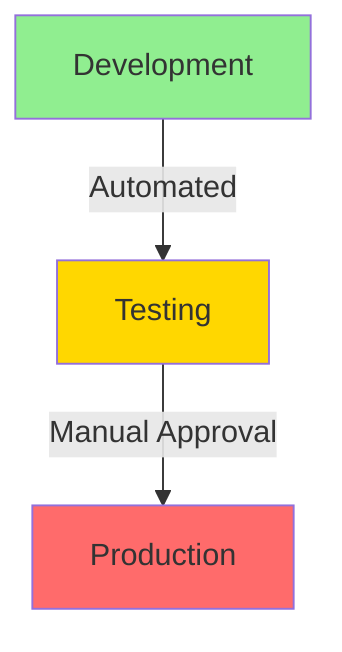
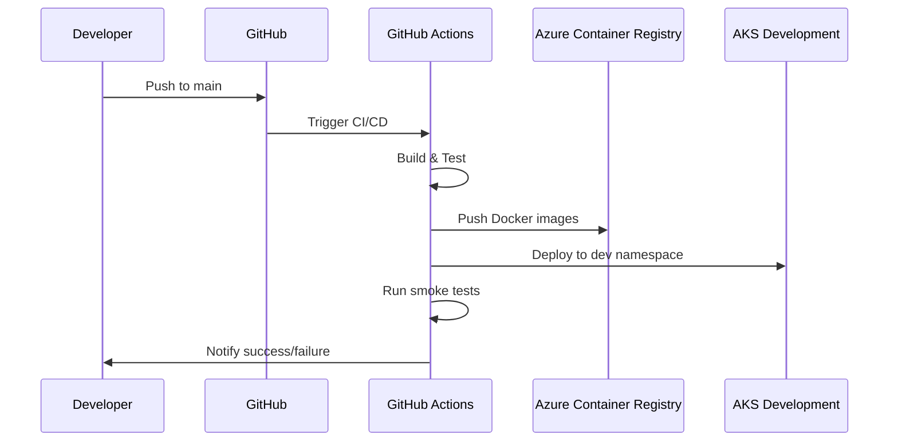
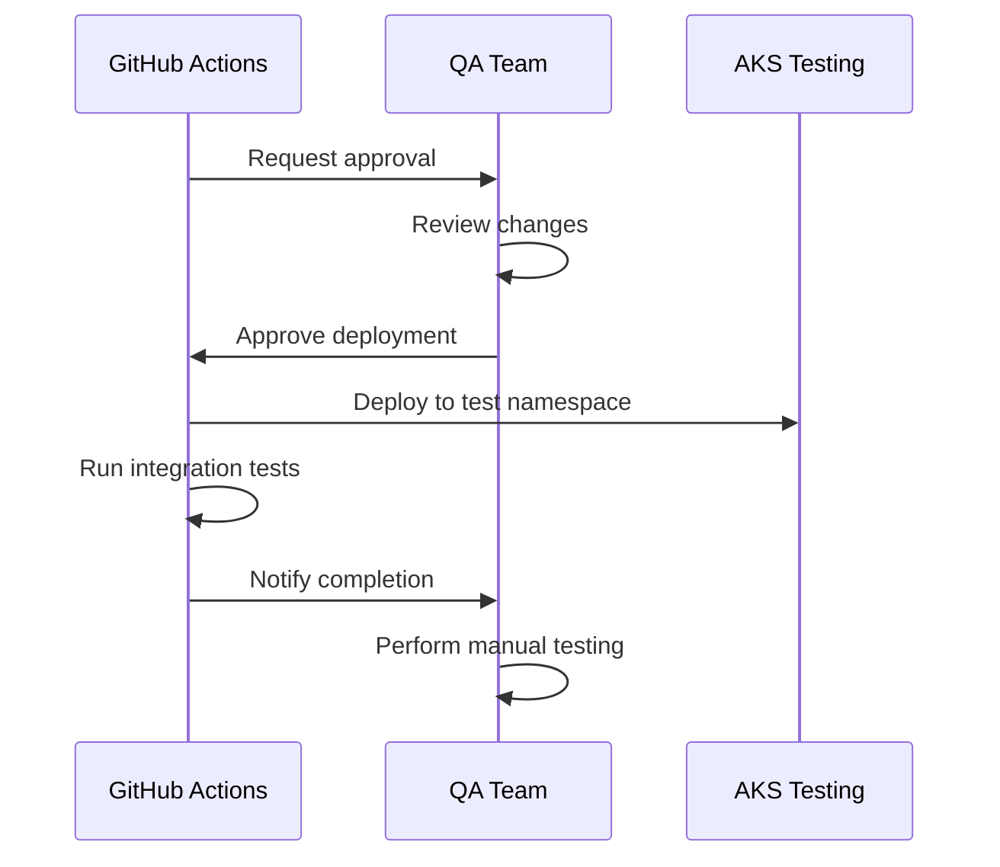
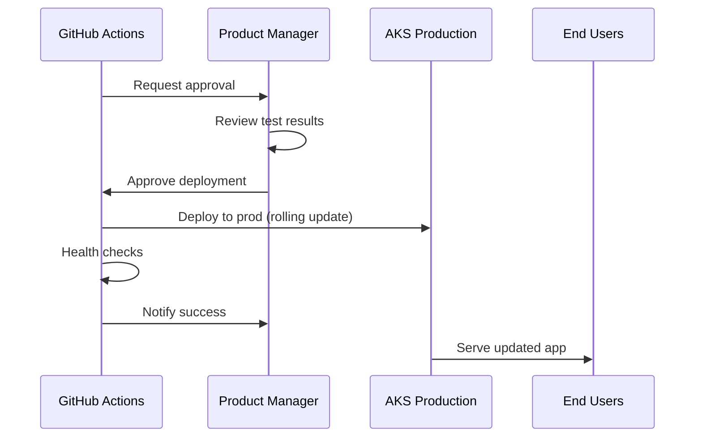

# Environment Promotion Strategy

## Overview

StudySphere uses a **three-tier environment promotion strategy** to ensure code quality and minimize production issues. Each environment serves a specific purpose in the software delivery lifecycle.

## Environment Hierarchy



## Environment Details

### 1. Development Environment

**Purpose:** Rapid iteration and developer testing

**Characteristics:**
- **Namespace:** `development`
- **URL:** `https://dev.studysphere.example.com`
- **Deployment:** Automatic on every `main` branch push
- **Approval:** None required
- **Data:** Test/mock data
- **Monitoring:** Basic logging
- **Resource Allocation:** Minimal (cost-optimized)

**Configuration:**
```yaml
replicas: 1-2
resources:
  requests:
    cpu: 50m
    memory: 64Mi
  limits:
    cpu: 200m
    memory: 256Mi
autoscaling:
  minReplicas: 1
  maxReplicas: 3
```

**Use Cases:**
- Feature development and testing
- Integration testing with other services
- Smoke tests for new deployments
- Developer experimentation

**Access:**
- Open to all developers
- No authentication restrictions
- Frequent resets

### 2. Testing Environment

**Purpose:** Quality assurance and stakeholder validation

**Characteristics:**
- **Namespace:** `testing`
- **URL:** `https://test.studysphere.example.com`
- **Deployment:** Manual approval after dev success
- **Approval:** QA team or tech lead
- **Data:** Staging data (production-like)
- **Monitoring:** Full logging and metrics
- **Resource Allocation:** Production-like

**Configuration:**
```yaml
replicas: 2
resources:
  requests:
    cpu: 100m
    memory: 128Mi
  limits:
    cpu: 500m
    memory: 512Mi
autoscaling:
  minReplicas: 2
  maxReplicas: 5
```

**Use Cases:**
- End-to-end integration testing
- User acceptance testing (UAT)
- Performance testing
- Security testing
- Demo to stakeholders

**Test Suites:**
- Integration tests (API contracts)
- UI automation tests (Playwright/Cypress)
- Load testing (k6)
- Accessibility testing (axe)

**Access:**
- QA team
- Product managers
- Selected stakeholders
- Basic authentication

### 3. Production Environment

**Purpose:** Live application serving real users

**Characteristics:**
- **Namespace:** `production`
- **URL:** `https://studysphere.example.com`
- **Deployment:** Manual approval after testing success
- **Approval:** Product owner or engineering manager
- **Data:** Real user data
- **Monitoring:** Comprehensive (alerts, dashboards)
- **Resource Allocation:** Optimized for performance and reliability

**Configuration:**
```yaml
replicas: 2-10
resources:
  requests:
    cpu: 100m
    memory: 128Mi
  limits:
    cpu: 1000m
    memory: 1Gi
autoscaling:
  minReplicas: 2
  maxReplicas: 10
  targetCPUUtilization: 50
```

**Use Cases:**
- Serve real student users
- Production data storage
- Revenue generation (future)

**SLA:**
- Uptime: 99.9% (8.76 hours downtime/year)
- Latency: p95 < 500ms
- Error rate: < 0.1%

**Access:**
- Public (authenticated users)
- Admin dashboard (restricted)

## Promotion Process

### Automated Development Deployment



### Manual Testing Deployment



### Manual Production Deployment



## Deployment Checklist

### Pre-Deployment (Development)
- [ ] All tests passing
- [ ] Code reviewed and merged
- [ ] Database migrations tested
- [ ] Environment variables configured
- [ ] Feature flags set (if applicable)

### Pre-Deployment (Testing)
- [ ] Dev deployment successful
- [ ] Smoke tests passed
- [ ] No critical bugs in dev
- [ ] QA team notified
- [ ] Test data prepared

### Pre-Deployment (Production)
- [ ] Testing deployment successful
- [ ] Integration tests passed
- [ ] UAT completed and signed off
- [ ] Performance benchmarks met
- [ ] Security scan passed
- [ ] Rollback plan documented
- [ ] Team notified of deployment window
- [ ] Database backup verified

### Post-Deployment (All Environments)
- [ ] Health checks green
- [ ] Pods running and ready
- [ ] No error spikes in logs
- [ ] Metrics within normal range
- [ ] Key user flows tested manually

## Configuration Management

### Environment-Specific Configurations

**Kubernetes Secrets:**
```bash
# Development
kubectl create secret generic azure-secrets \
  --from-literal=DATABASE_URL=$DEV_DATABASE_URL \
  --from-literal=JWT_SECRET=$DEV_JWT_SECRET \
  -n development

# Testing
kubectl create secret generic azure-secrets \
  --from-literal=DATABASE_URL=$TEST_DATABASE_URL \
  --from-literal=JWT_SECRET=$TEST_JWT_SECRET \
  -n testing

# Production
kubectl create secret generic azure-secrets \
  --from-literal=DATABASE_URL=$PROD_DATABASE_URL \
  --from-literal=JWT_SECRET=$PROD_JWT_SECRET \
  -n production
```

**ConfigMaps:**
```yaml
# dev-config.yaml
apiVersion: v1
kind: ConfigMap
metadata:
  name: app-config
  namespace: development
data:
  NODE_ENV: "development"
  LOG_LEVEL: "debug"
  CORS_ORIGIN: "https://dev.studysphere.example.com"
```

### Feature Flags

**Implementation:**
```javascript
const features = {
  development: {
    newDashboard: true,
    betaFeatures: true,
    debugMode: true
  },
  testing: {
    newDashboard: true,
    betaFeatures: true,
    debugMode: false
  },
  production: {
    newDashboard: false,
    betaFeatures: false,
    debugMode: false
  }
};

const isFeatureEnabled = (feature) => {
  return features[process.env.NODE_ENV][feature];
};
```

## Rollback Procedures

### Automatic Rollback (Kubernetes)

**Triggered on:**
- Liveness probe failures
- CrashLoopBackOff
- Deployment timeout (10 minutes)

**Process:**
```bash
# Kubernetes automatically reverts to previous ReplicaSet
kubectl rollout status deployment/auth-service -n production
# If unhealthy, Kubernetes rolls back automatically
```

### Manual Rollback

**Steps:**
```bash
# 1. Check rollout history
kubectl rollout history deployment/auth-service -n production

# 2. Identify last good revision
kubectl rollout history deployment/auth-service --revision=5 -n production

# 3. Rollback to specific revision
kubectl rollout undo deployment/auth-service --to-revision=5 -n production

# 4. Verify rollback
kubectl rollout status deployment/auth-service -n production
kubectl get pods -n production

# 5. Check logs
kubectl logs -l app=auth-service -n production --tail=100
```

**Database Rollback:**
```bash
# Connect to PostgreSQL
psql $DATABASE_URL

# Rollback migration
npm run prisma:migrate:rollback

# Or restore from backup
az postgres flexible-server restore \
  --resource-group studysphere-rg \
  --name studysphere-postgres-prod \
  --restore-point-in-time "2024-01-15T10:00:00Z"
```

## Monitoring Per Environment

### Development
- Basic application logs
- Error tracking (Sentry - free tier)
- No alerts

### Testing
- Full application logs
- Integration test results
- Performance metrics
- No critical alerts

### Production
- Full observability stack
- Real-time dashboards
- Alert rules:
  - Error rate > 1%
  - Latency p95 > 1s
  - Pod restart > 5 times/hour
  - CPU/Memory > 80%
- On-call rotation
- Incident management

## Database Management

### Development Database
- **Type:** Shared PostgreSQL instance
- **Data:** Synthetic test data
- **Backups:** None
- **Reset:** Weekly or on-demand

### Testing Database
- **Type:** Dedicated PostgreSQL instance
- **Data:** Anonymized production data
- **Backups:** Daily
- **Reset:** After major test cycles

### Production Database
- **Type:** Azure PostgreSQL Flexible Server (High Availability)
- **Data:** Real user data
- **Backups:** Automated daily (7-day retention)
- **Reset:** Never (only restore)

**Migration Strategy:**
```bash
# Apply migrations to dev
cd shared
npx prisma migrate dev --name add_user_interests

# Test in development
npm test

# Apply to testing (manual approval)
npx prisma migrate deploy

# Verify in testing
# ... manual QA ...

# Apply to production (manual approval, during maintenance window)
npx prisma migrate deploy
```

## Traffic Management

### Blue-Green Deployment (Future)

**Concept:**
- Run two identical production environments (blue and green)
- Route traffic to blue (active)
- Deploy new version to green (inactive)
- Test green thoroughly
- Switch traffic to green
- Keep blue as rollback option

**Kubernetes Implementation:**
```yaml
# Service with selector
apiVersion: v1
kind: Service
metadata:
  name: auth-service
spec:
  selector:
    app: auth-service
    version: blue  # Switch to green after validation
```

### Canary Deployment (Future)

**Concept:**
- Deploy new version to small subset of pods (10%)
- Monitor metrics closely
- Gradually increase traffic (25%, 50%, 100%)
- Rollback if issues detected

**Istio/Linkerd Implementation** (future enhancement)

## Environment Comparison

| Feature | Development | Testing | Production |
|---------|------------|---------|------------|
| **Deployment** | Automatic | Manual Approval | Manual Approval |
| **Approvers** | None | QA Team | Product Manager |
| **Data** | Test data | Staging data | Real data |
| **Replicas** | 1-2 | 2 | 2-10 |
| **Resources** | Minimal | Medium | High |
| **Monitoring** | Basic | Full | Comprehensive |
| **Alerts** | None | Optional | Critical |
| **Backups** | No | Yes | Yes (automated) |
| **Uptime SLA** | None | 95% | 99.9% |
| **Cost** | Low | Medium | High |

## Best Practices

### 1. Always Test in Lower Environments First
- Never deploy directly to production
- Use dev for rapid iteration
- Use testing for validation

### 2. Keep Environments Consistent
- Use same Docker images across environments
- Only change environment variables
- Avoid "works on my machine" issues

### 3. Automate Where Possible
- Automated deployments to dev
- Automated tests in all environments
- Automated rollbacks on failures

### 4. Monitor Everything
- Log all deployments
- Track metrics per environment
- Set up alerts for production

### 5. Document Changes
- Changelog per deployment
- Git commit messages
- Rollback procedures

### 6. Use Feature Flags
- Enable features per environment
- Gradual rollout in production
- Easy rollback without redeployment

## Troubleshooting

### Issue: Deployment Stuck in Pending

**Cause:** Resource constraints

**Solution:**
```bash
# Check pod events
kubectl describe pod <pod-name> -n production

# Scale up nodes or adjust resource requests
kubectl scale deployment auth-service --replicas=1 -n production
```

### Issue: Different Behavior Across Environments

**Cause:** Configuration drift

**Solution:**
1. Compare environment variables
2. Check secret values
3. Verify database schemas match
4. Review feature flag settings

### Issue: Cannot Rollback

**Cause:** Database migration incompatibility

**Solution:**
1. Create backward-compatible migrations
2. Use two-phase migrations (add column, then use it)
3. Test rollback in testing environment

## Metrics and KPIs

### Deployment Frequency
- **Target:** 2+ deployments/week to production
- **Current:** Track via GitHub Actions

### Lead Time
- **Target:** < 2 hours (commit to production)
- **Current:** ~20 minutes (dev to prod)

### Change Failure Rate
- **Target:** < 15%
- **Current:** Track rollbacks and hotfixes

### Mean Time to Recovery (MTTR)
- **Target:** < 1 hour
- **Current:** Measure from incident to resolution

---

## References

- [GitOps Principles](https://www.gitops.tech/)
- [Kubernetes Deployment Strategies](https://kubernetes.io/docs/concepts/workloads/controllers/deployment/#strategy)
- [Azure DevOps Best Practices](https://learn.microsoft.com/en-us/azure/architecture/checklist/dev-ops)

