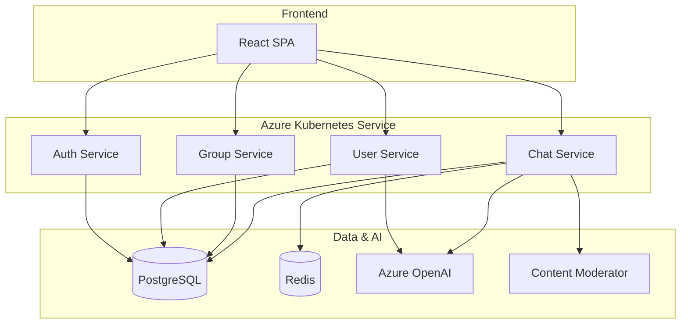
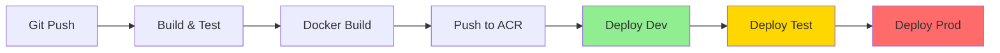
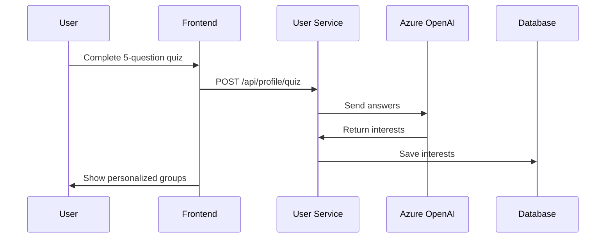
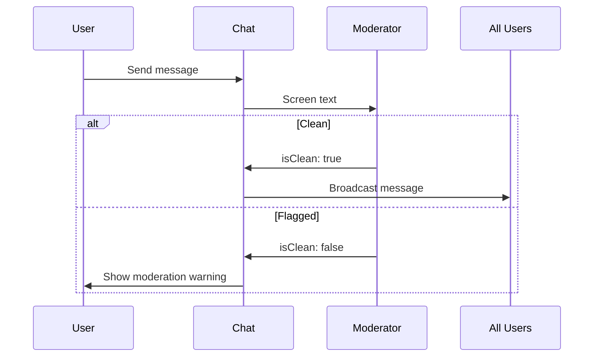
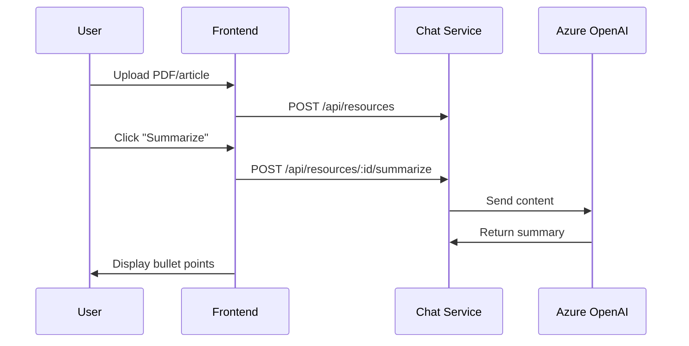

# StudySphere - Project Review II Presentation

## Presentation Outline (8-10 Slides, 10 minutes)

---

### Slide 1: Title Slide

**StudySphere: AI-Powered Study Group Platform**

Cloud Computing - Project Review II

Team Members:
- [Team Member 1] - DevOps & Infrastructure
- [Team Member 2] - Backend Microservices
- [Team Member 3] - Frontend & UI/UX
- [Team Member 4] - GenAI Integration

Date: [Presentation Date]

---

### Slide 2: Project Overview

**What is StudySphere?**

A cloud-native platform for college students to:
- Create and join study groups
- Collaborate in real-time chat
- Schedule study sessions (Google Meet integration)
- Share resources with AI-generated summaries
- Get personalized study recommendations

**Tech Stack:**
- Frontend: React + Tailwind + shadcn/ui
- Backend: Node.js microservices
- Database: Azure PostgreSQL
- Infrastructure: Azure (AKS, ACR)
- AI: Azure OpenAI + Content Moderator

---

### Slide 3: System Architecture



**Microservices Architecture:**
- 4 independent services (Auth, User, Group, Chat)
- Socket.io for real-time communication
- Prisma ORM for database access
- JWT authentication with httpOnly cookies

---

### Slide 4: DevOps - CI/CD Pipeline

**GitHub Actions Workflow:**



**Pipeline Stages:**
1. **Build & Test** (3-5 min) - Jest tests, ESLint, build artifacts
2. **Docker Build** (5-8 min) - 5 images, tagged with commit SHA
3. **Deploy Dev** (2-3 min) - Automatic deployment + smoke tests
4. **Deploy Test** (2-3 min) - Manual approval + integration tests
5. **Deploy Prod** (3-5 min) - Manual approval + health checks

**Environment Promotion:** Dev → Test → Prod with approval gates

---

### Slide 5: DevOps - Infrastructure as Code

**Terraform Configuration:**

**Provisioned Resources:**
- ✅ Resource Group (studysphere-rg)
- ✅ PostgreSQL Flexible Server (studysphere-postgres)
- ✅ Azure Container Registry (studysphereacr)
- ✅ Azure Kubernetes Service (studysphere-aks)
- ✅ Log Analytics Workspace

**Key Features:**
- Remote state in Azure Storage
- Automated provisioning via `apply.sh`
- Cost optimization (B-series VMs for dev)
- Auto-scaling node pools (2-10 nodes)

**Commands:**
```bash
terraform init
terraform plan
./infra/apply.sh  # Provisions entire stack
```

---

### Slide 6: Containerization & Orchestration

**Docker:**
- Multi-stage builds for frontend (Node + Nginx)
- Optimized images (node:18-alpine base)
- Pushed to Azure Container Registry
- Tagged with commit SHA + latest

**Kubernetes (AKS):**
- 3 namespaces: development, testing, production
- 5 deployments (auth, user, group, chat, frontend)
- ClusterIP services + LoadBalancer for frontend
- Horizontal Pod Autoscaling (HPA) at 50% CPU
- Liveness & readiness probes
- Resource limits enforced

**High Availability:**
- Min 2 replicas per service
- Auto-scaling up to 10 replicas
- Rolling updates with zero downtime

---

### Slide 7: GenAI Use Case 1 - Quiz Classification

**Problem:** How to match students with relevant study groups?

**Solution:** Azure OpenAI classifies quiz answers into interests

**Flow:**


**Example:**
- Input: ["Computer Science", "Algorithms", "Evening", "Group", "Active"]
- Output: ["CS", "Algorithms", "Data Structures", "Problem Solving"]

**Why Azure OpenAI?**
- Contextual understanding (better than keywords)
- Cost-effective (gpt-4o-mini: $0.00005/request)
- Scalable for high volume

**Demo:** [Show quiz flow in UI]

---

### Slide 8: GenAI Use Case 2 - Content Moderation

**Problem:** Prevent harmful content in student chat rooms

**Solution:** Azure Content Moderator screens messages in real-time

**Flow:**


**Detection:**
- Offensive language & profanity
- Sexually suggestive content
- Violent or graphic content
- PII (emails, phone numbers)

**Why Content Moderator?**
- Real-time (<100ms latency)
- Education-compliant (COPPA, FERPA)
- Free tier: 5,000 transactions/month

**Demo:** [Send flagged message, show moderation]

---

### Slide 9: GenAI Use Case 3 - Resource Summarization

**Problem:** Students don't have time to read long documents

**Solution:** Azure OpenAI generates bullet-point summaries

**Flow:**


**Example:**
- Input: 1500-word article on Binary Search Trees
- Output:
  - • BSTs organize data hierarchically
  - • Search/insert/delete: O(log n) average
  - • Can become unbalanced (O(n) worst case)
  - • Self-balancing variants maintain O(log n)

**Why Azure OpenAI?**
- High-quality summaries (GPT-4o-mini)
- Understands technical terminology
- Cost: $0.00025/summary

**Demo:** [Upload resource, show AI summary]

---

### Slide 10: Key Achievements & Deliverables

**✅ DevOps (20 marks)**
- Terraform IaC for Azure resources
- GitHub Actions CI/CD pipeline
- Multi-environment promotion (dev/test/prod)

**✅ Containerization (20 marks)**
- Dockerfiles for all 5 services
- Azure Container Registry
- Kubernetes deployments + HPA
- Helm chart structure

**✅ GenAI Integration (20 marks)**
- 3 use cases with different AI services
- Working implementations
- Cost analysis and justification

**✅ Documentation (15 marks)**
- Architecture diagrams (Mermaid)
- GenAI use cases with flows
- Pipeline documentation
- This presentation

**Live Demo:** [10-minute walkthrough]

---

### Slide 11: Live Demo Script (10 minutes)

**Part 1: CI/CD Pipeline (3 min)**
1. Show GitHub repository structure
2. Display GitHub Actions workflow
3. Show recent pipeline run
4. Navigate to Azure Portal → ACR (container images)
5. Show AKS cluster → Pods running

**Part 2: Containerization (3 min)**
1. Run `kubectl get pods -n production`
2. Show deployments and services
3. Display HPA scaling
4. Show ingress configuration
5. Access app via LoadBalancer IP

**Part 3: GenAI Features (2 min)**
1. Register new user
2. Complete quiz → Show AI-generated interests
3. Send flagged message → Show moderation
4. Upload resource → Generate AI summary

**Part 4: Q&A (2 min)**

---

### Slide 12: Challenges & Learnings

**Challenges Faced:**
- Microservice communication complexity
- Socket.io scaling across multiple pods
- Azure PostgreSQL connectivity issues
- Kubernetes secret management
- GenAI API rate limits

**Solutions:**
- Used Redis adapter for Socket.io
- Proper firewall rules for PostgreSQL
- Kubernetes secrets + environment variables
- Implemented retry logic for AI APIs

**Key Learnings:**
- Terraform state management is critical
- Always test in lower environments first
- Monitoring is essential for production
- GenAI can greatly enhance UX

---

### Slide 13: Future Enhancements

**Phase 2 (Next Semester):**
- Video calling (Azure Communication Services)
- Mobile apps (React Native)
- Advanced analytics dashboard
- Notification system

**Phase 3:**
- Multi-region deployment
- GraphQL API layer
- Serverless functions (Azure Functions)

**Phase 4:**
- AI study assistant chatbot
- Automated quiz generation
- Smart scheduling with calendar integration

---

### Slide 14: Thank You & Questions

**Project Links:**
- GitHub: [Repository URL]
- Live Demo: https://studysphere.example.com
- Documentation: [Docs folder]

**Contact:**
- Team Lead: [email@college.edu]
- Team Members: [emails]

**Questions?**

---

## Presentation Tips

### Timing (10 minutes total)
- Slides 1-3 (Overview & Architecture): 2 minutes
- Slides 4-6 (DevOps & Containers): 3 minutes
- Slides 7-9 (GenAI Use Cases): 3 minutes
- Slide 10 (Achievements): 1 minute
- Slide 11 (Live Demo): 10 minutes (separate from slides)
- Q&A: 2-3 minutes

### Presentation Style
- **Slide 1-2:** Quickly introduce the project and team
- **Slide 3:** Focus on architecture diagram, explain microservices
- **Slide 4-5:** Highlight CI/CD automation and Terraform
- **Slide 6:** Emphasize Kubernetes features (HPA, zero-downtime)
- **Slide 7-9:** Spend most time here - show real value of GenAI
- **Slide 10:** Quick recap of deliverables
- **Live Demo:** Practice beforehand, have backup screenshots

### Talking Points for Each Slide

**Slide 3 (Architecture):**
- "We built a microservices architecture with 4 independent services"
- "Auth handles authentication, User manages profiles with AI quiz"
- "Group manages study groups, Chat handles real-time messaging"
- "All running on Azure Kubernetes Service for scalability"

**Slide 4 (CI/CD):**
- "Our pipeline automates the entire deployment process"
- "Every push to main triggers build, test, and deployment"
- "We use approval gates for testing and production"
- "This ensures code quality and reduces human error"

**Slide 7 (Quiz Classification):**
- "When students register, they take a 5-question quiz"
- "Azure OpenAI analyzes their answers and identifies interests"
- "This helps match them with relevant study groups"
- "It's much smarter than simple keyword matching"

**Slide 8 (Content Moderation):**
- "Safety is critical in an educational platform"
- "Content Moderator screens every chat message in real-time"
- "It detects offensive language, PII, and inappropriate content"
- "Flagged messages are blocked automatically"

**Slide 9 (Resource Summarization):**
- "Students often share long PDFs and articles"
- "Our AI generates concise bullet-point summaries"
- "This saves time and helps students quickly understand content"
- "Summaries are displayed with a sparkle icon in the UI"

### Demo Preparation

**Before Presentation:**
1. Have app deployed and accessible
2. Create test accounts with demo data
3. Prepare specific messages to test moderation
4. Have a sample PDF ready for summarization
5. Open Azure Portal tabs (ACR, AKS)
6. Open GitHub Actions page
7. Have kubectl commands ready in terminal

**Backup Plan:**
- Record video demo in case of connectivity issues
- Take screenshots of all steps
- Have mock data in presentation slides

### Visual Aids

**Embed in Slides:**
- Architecture diagram (Mermaid)
- CI/CD pipeline flow (Mermaid)
- Sequence diagrams for GenAI use cases
- Screenshots of Azure Portal (ACR, AKS)
- Screenshots of app UI
- Code snippets (syntax highlighted)

### Q&A Preparation

**Expected Questions:**

1. **"Why did you choose microservices over monolith?"**
   - Answer: Scalability, independent deployment, technology flexibility, better for team collaboration

2. **"How do you handle database migrations in production?"**
   - Answer: Prisma migrations, tested in dev/test first, applied during maintenance window, have rollback plan

3. **"What's your disaster recovery plan?"**
   - Answer: Automated backups (7-day), Terraform for infra reproducibility, K8s auto-restarts pods, manual restore if needed

4. **"How much does this cost to run on Azure?"**
   - Answer: Dev ~$50/month, Prod ~$200/month (B-series VMs, minimal replicas, free AI tiers)

5. **"Why Azure over AWS or GCP?"**
   - Answer: Azure OpenAI integration, student credits, enterprise support, familiar ecosystem

6. **"How do you ensure data privacy with AI?"**
   - Answer: Azure's enterprise compliance (GDPR, FERPA), data not used for training, PII detection

7. **"Can this scale to 10,000 users?"**
   - Answer: Yes - HPA scales pods, PostgreSQL can handle load, Redis for Socket.io scaling, CDN for static assets

---

## Presentation Checklist

**Day Before:**
- [ ] Test live demo end-to-end
- [ ] Verify all services running
- [ ] Check Azure Portal access
- [ ] Prepare backup slides/video
- [ ] Review talking points
- [ ] Practice timing (10 min)

**Before Presentation:**
- [ ] Open all necessary tabs
- [ ] Connect laptop to projector
- [ ] Test audio/video
- [ ] Have backup internet connection
- [ ] Water bottle ready
- [ ] Team members briefed on roles

**During Presentation:**
- [ ] Introduce team
- [ ] Speak clearly and confidently
- [ ] Maintain eye contact
- [ ] Don't read slides verbatim
- [ ] Show enthusiasm for GenAI features
- [ ] Handle Q&A professionally

---

## Slide Design Recommendations

**Color Scheme:**
- Primary: Purple (#8B5CF6) - matches StudySphere branding
- Secondary: Blue (#3B82F6)
- Accent: Green (#10B981) for success, Red (#EF4444) for alerts
- Background: White or light gray
- Code blocks: Dark theme with syntax highlighting

**Fonts:**
- Headings: Inter or SF Pro (bold)
- Body: Inter or system default
- Code: Fira Code or Monaco (monospace)

**Layout:**
- Minimal text per slide
- Large diagrams and visuals
- Use bullet points sparingly
- Emphasize with bold/color
- Include team logo/university logo

---

**Good luck with your presentation! 🚀**

